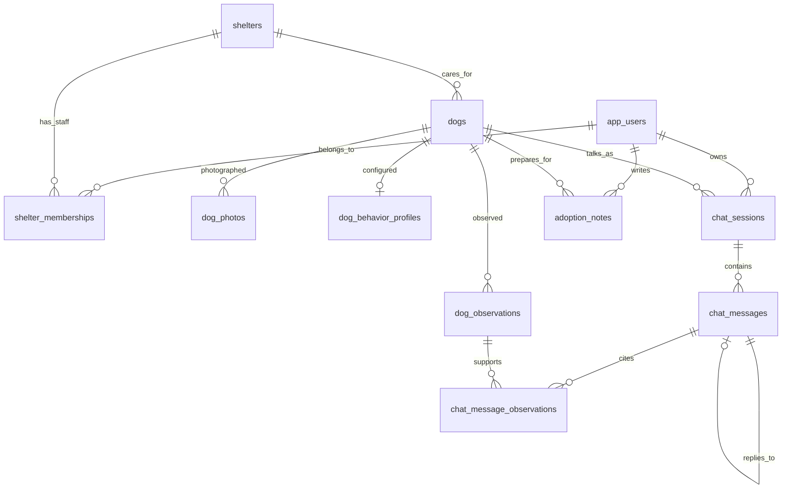

# 데이터 구조 · B-01

보호소가 관리하는 강아지 정보와 사용자의 대화·메모를 분리한다. 도트로 처음 만나고, 대화한 뒤 사진을 보는 흐름에 맞춰 사진은 별도 테이블에 둔다.

이 문서는 PostgreSQL 저장 구조의 기준이다. 현재 노션 API 초안의 용어를 따르되, **C-03의 프론트 응답 필드 합의까지 완료된 것은 아니다.** 로그인 방식, 사진 공개 조건, 행동 설정의 세부 수치는 각각 C-02·B-04·B-08·B-10에서 정한다.

실제 테이블 정의는 [V1 마이그레이션](../backend/src/main/resources/db/migration/V1__create_shelter_domain.sql)에 있다. B-03의 [조회 API](read-api.md)는 필요한 필드만 JDBC로 조회한다. 등록·수정과 권한 검사는 후속 PR에서 구현한다.

## 한눈에 보는 관계



관찰 작성자·확인자, 사진 사용 허가 확인자, 행동 설정 확인자도 `app_users`에 연결된다. 그림은 주된 관계만 표시했다.

| 테이블 | 담는 내용 | 주요 관계 |
| --- | --- | --- |
| `app_users` | 사용자, 운영자, 외부 인증 식별자 | 한 사용자는 여러 보호소에 소속될 수 있음 |
| `shelters` | 보호소 위치·공식 연락처·승인·공개 상태 | 보호소 하나에 강아지 여러 마리 |
| `shelter_memberships` | 보호소 소속과 담당 권한 | 사용자+보호소 조합당 1개 |
| `dogs` | 도트 프로필, 기본 정보, 입양 상태 | 보호소 1곳에 소속 |
| `dog_observations` | 실제 관찰 기록과 확인 이력 | 강아지별 여러 기록 |
| `dog_photos` | 사진 저장 경로·순서·사용 허가 | 강아지별 여러 사진 |
| `dog_behavior_profiles` | 8종 동작에 매칭할 설정과 승인 | 강아지당 0~1개 |
| `chat_sessions` | 사용자와 강아지의 대화방 | 생성 후 사용자·강아지 고정 |
| `chat_messages` | 질문·답변·재시도 식별자·처리 상태 | 대화방별 여러 메시지 |
| `chat_message_observations` | 답변 근거와 당시 기록 내용 | 같은 강아지 기록만 연결 |
| `adoption_notes` | 입양 전 질문·돌봄 계획·체크 항목 | 사용자+강아지 조합당 1개 |

## 공통 규칙

- ID는 PostgreSQL `uuid`. API에서는 UUID 문자열로 전달한다. 노션의 `dog_demo_001` 같은 값은 화면 설명용 예시이며 실제 저장 ID가 아니다.
- 생성·수정 시각은 `timestamptz`. API는 UTC의 ISO 8601 문자열, 화면은 한국 시간으로 표시한다. `updated_at`은 DB 트리거로 갱신한다.
- 모르는 단일 값은 `NULL`, 목록이 비어 있으면 빈 배열. 미확인을 `false`나 임의의 날짜로 채우지 않는다.
- 상태는 제한된 문자열+CHECK 제약으로 저장한다. PostgreSQL ENUM 대신 문자열을 써서 후속 상태 변경은 버전 마이그레이션으로 관리한다.
- 연쇄 삭제는 사용하지 않는다. 보호 중단·입양 완료·계정 비활성화는 상태로 남긴다. 탈퇴 시 개인정보 보관·삭제 정책은 기능 제공 전에 별도로 정한다.
- DB의 참조 무결성과 실제 사용자 권한 검사는 역할이 다르다. FK가 있다는 이유만으로 다른 사람의 행을 읽거나 수정할 수 있게 해서는 안 된다.

## 사용자와 보호소

### `app_users`

| 필드 | 형식 | 의미 |
| --- | --- | --- |
| `id` | uuid | 서비스 내부 사용자 ID |
| `display_name` | varchar(80), 필수 | 표시 이름 |
| `role` | USER / OPERATOR | 일반 사용자 / 서비스 운영자 |
| `auth_provider`, `auth_subject` | varchar(40), varchar(255), 선택 | 외부 인증 제공자와 해당 제공자의 사용자 ID. 둘 다 입력하거나 둘 다 비움 |
| `disabled_at` | timestamptz, 선택 | 계정 비활성화 시각 |

비밀번호·개인 이메일은 이 단계에서 저장하지 않는다. `(auth_provider, auth_subject)`는 중복되지 않는다. 인증 방식은 B-04에서 정하고, 인증 정보가 비어 있는 행은 샘플·초기 구성용으로만 사용한다. 클라이언트가 보낸 userId를 그대로 로그인된 사용자로 인정하지 않는다.

### `shelters`와 `shelter_memberships`

- 보호소: `name`, `region`, `address`, `latitude`, `longitude`, `contact_phone`, `website_url`, `map_key`.
- 좌표는 둘 다 있거나 둘 다 비어야 한다. 위도 -90~90, 경도 -180~180. 지역 코드 체계와 거리 정렬은 C-03·B-03에서 정한다.
- `approval_status`: PENDING / APPROVED / REJECTED / SUSPENDED. 기본은 PENDING.
- `is_public`: 기본 false. 공개하려면 APPROVED이고 `reviewed_by`, `reviewed_at`이 있어야 한다.
- 소속의 `role`: MANAGER / STAFF, `status`: INVITED / ACTIVE / REVOKED. 기본은 STAFF·INVITED.
- 같은 사용자와 보호소에 소속 행을 중복 생성하지 않는다. 재가입은 기존 행의 상태를 갱신한다.

B-04·B-05는 **로그인 사용자 + ACTIVE 소속 + APPROVED 보호소 + 대상 동물의 shelterId**를 함께 확인해야 한다. 승인 작업은 OPERATOR만 할 수 있도록 API에서 검사한다. 현재 FK는 확인자가 존재한다는 것만 보장한다.

## 강아지 정보

### `dogs`

| 필드 | 형식·기본값 | 의미 |
| --- | --- | --- |
| `shelter_id` | uuid, 필수 | 소속 보호소 |
| `name`, `avatar_key` | varchar(80), varchar(100), 필수 | 이름과 도트 에셋 키 |
| `sex` | MALE / FEMALE / UNKNOWN | 성별. 기본 UNKNOWN |
| `breed` | varchar(120), 선택 | 보호소가 입력한 품종·믹스 설명 |
| `birth_date` | date, 선택 | 알고 있는 범위를 저장한 날짜 |
| `birth_date_precision` | UNKNOWN / YEAR / MONTH / DAY | 알고 있는 범위 |
| `birth_date_estimated` | boolean, 선택 | 알려진 날짜가 추정인지 여부 |
| `weight_kg` | numeric(6,2), 선택 | 양수 체중 |
| `neutered` | boolean, 선택 | true 완료 / false 미실시 / NULL 미확인 |
| `adoption_status` | AVAILABLE / IN_PROGRESS / ADOPTED / PAUSED | 기본 PAUSED |
| `is_public` | boolean, 기본 false | 공개 여부 |
| `trait_labels` | text[], 기본 빈 배열 | 최대 8개 소개 태그 |
| `introduction` | text, 선택 | 보호소가 작성한 소개 |
| `archived_at` | timestamptz, 선택 | 현재 탐색 목록에서 제외할 시각 |

첫 버전은 강아지 전용이므로 DB에 여러 종을 허용하는 필드는 아직 두지 않는다. 목록 DTO의 `species`는 `DOG`로 내려줄 수 있다. 고양이 지원을 결정하면 별도 마이그레이션으로 확장한다.

생일 표시 예시:

| 저장 | 화면에서 보여줄 정보 |
| --- | --- |
| NULL / UNKNOWN / NULL | 생일을 아직 몰라요 |
| 2022-01-01 / YEAR / true | 2022년생 추정 |
| 2022-07-01 / MONTH / true | 2022년 7월생 추정 |
| 2022-07-28 / DAY / false | 2022년 7월 28일 |

YEAR의 1월 1일, MONTH의 1일은 정렬과 저장을 위한 기준값이다. **그 날짜를 실제 생일로 표시하지 않는다.** 알 수 없는 생일에는 날짜나 추정 여부를 채울 수 없고, 정밀도와 날짜가 맞지 않으면 DB가 거절한다. 미래 생일 등 입력값 검사는 등록 API에서 추가한다.

태그는 확인된 관찰을 요약한 문구다. B-05에서 기록과 대조해 저장하고, 품종 일반론을 특정 강아지의 사실처럼 넣지 않는다. `avatar_key`의 실제 에셋 매핑도 프론트와 확인한다.

공개 조회는 승인·공개 보호소와 `dogs.is_public = true`, `archived_at IS NULL`을 함께 검사한다. B-03 목록·상세·공개 마릿수는 `AVAILABLE`, `IN_PROGRESS`만 포함한다. DB에서 강아지의 공개 여부와 보호소 승인을 자동으로 동기화하지 않는다.

### `dog_observations`

`dog_id`, `category`, `content`, `observed_at`, `recorded_by`, `source_note`를 저장한다.

- 분류: TEMPERAMENT / ROUTINE / PEOPLE / DOGS / PLAY / CARE / HEALTH / OTHER.
- 상태: DRAFT → CONFIRMED, 철회하면 RETRACTED.
- CONFIRMED에는 `confirmed_by`, `confirmed_at`이 필요하다.
- B-07의 답변 근거 조회는 해당 강아지의 **CONFIRMED 기록만** 사용한다. 상태와 작성자의 소속 검사는 서버에서 수행한다.

### `dog_photos`

`dog_id`, `storage_bucket`, `storage_key`, `sort_order`, `caption`, `source_note`를 저장한다. 순서는 0부터 시작하며 강아지별로 중복되지 않는다. 같은 강아지에 동일 파일을 중복 등록하지 않는다.

`rights_status`는 UNKNOWN / GRANTED / REVOKED. GRANTED에는 사용 범위인 `rights_note`와 `rights_confirmed_by`, `rights_confirmed_at`이 필요하다. 만료되는 서명 URL 대신 원본 저장 위치를 보관한다.

B-08에서 사용자 공개 조건과 사용 허가를 확인한 뒤 사진 응답을 만든다. 테이블을 분리하는 것만으로 사진이 숨겨지는 것은 아니다. 실제 파일을 저장할 때는 비공개 버킷과 접근 방식도 함께 설정해야 한다.

### `dog_behavior_profiles`

강아지당 설정 1개. `schema_version`, JSON 객체인 `settings`, `source`(SHELTER / AI_SUGGESTED), `status`(DRAFT / CONFIRMED), 확인자·확인 시각을 저장한다.

미리 만든 IDLE / WALK / RUN / SNIFF / TAIL_WAG / BACK_OFF / SIT / LIE_DOWN에 매칭할 데이터다. AI가 제안해도 기본 상태는 DRAFT이며 확인 기록이 있어야 CONFIRMED로 바뀐다.

B-01에서는 저장 위치·버전·확인 상태만 정의한다. 속도·확률·거리의 단위와 범위, 8개 동작의 키, 근거 기록 연결·유효성 검사는 **B-10에서 확정**한다. 현재 `{}`는 빈 설정이며 실행용 설정이 아니다. 프론트에 전달하기 전 B-10의 검증이 필요하다.

## 대화와 입양 준비

### `chat_sessions`와 `chat_messages`

대화방은 `user_id`, `dog_id`, `status`(OPEN / CLOSED)를 가진다. 한 사용자가 같은 강아지와 여러 대화방을 만들 수 있다. 최근 대화방 재사용 정책은 B-06에서 정한다.

대화방의 ID·사용자·강아지는 생성 후 바꿀 수 없다. 메시지도 ID·소속 대화방·강아지·역할·요청 ID·답변 대상을 바꿀 수 없다. 이동이 필요하면 새 대화방을 만든다.

| 필드 | 의미 |
| --- | --- |
| `session_id`, `dog_id` | 같은 대화방의 같은 강아지를 참조해야 함 |
| `role` | USER / ASSISTANT. API 예시의 소문자와는 DTO에서 변환 |
| `content` | 비어 있지 않은 본문. DB 상한 12,000자, 화면 입력 한도는 C-03에서 합의 |
| `client_message_id` | 사용자 요청의 식별자. 사용자 메시지에 필수, 대화방 내 중복 금지 |
| `reply_to_message_id` | AI 답변이 참조하는 같은 대화방의 사용자 메시지 |
| `processing_status` | 사용자 요청: PENDING / COMPLETED / FAILED. 저장된 AI 답변: COMPLETED |
| `failure_code` | FAILED일 때만 필수. 내부 오류 전문이나 인증 정보는 넣지 않음 |
| `needs_shelter_confirmation` | 답변에서 보호소 확인이 필요한지 여부 |

사용자 메시지 하나에 완료된 답변은 최대 1개다. 같은 요청을 다시 보내면 기존 요청을 조회하고, 내용이 다르면 충돌로 처리한다. DB의 UNIQUE만으로 외부 AI 호출·과금까지 한 번이 되는 것은 아니다. B-06·B-07에서 작업 선점, 실패 복구, 답변과 요청 상태의 원자적 저장을 구현한다.

실패 시에는 사용자 요청을 FAILED로 남긴다. 재시도하면 같은 행을 PENDING으로 갱신한다. 아직 생성되지 않은 AI 답변을 빈 본문으로 저장하지 않는다.

### `chat_message_observations`

`message_id`, `observation_id`, `dog_id`, `observation_snapshot`을 저장한다. 복합 FK로 메시지와 관찰의 강아지가 같은지 검사한다. 기록 내용이 나중에 수정돼도 당시 참고한 내용은 snapshot으로 남는다.

B-07은 ASSISTANT 메시지에 그 시점의 CONFIRMED 관찰만 연결해야 한다. DB는 같은 강아지인지 보장하지만, 응답 생성 당시의 확인 상태와 실제 사용 여부까지 판단하지 않는다.

### `adoption_notes`

`user_id`, `dog_id`당 하나의 메모. `questions`, `care_plan`은 텍스트, `checklist`는 버전 합의 전 JSON 객체로 저장한다. 빈 메모를 허용한다.

실제 입양 신청서나 제출 완료 기록은 아니다. B-09에서 본인만 접근할 수 있도록 하고, 체크 항목 키와 저장 충돌 처리를 정한다.

## 조회와 접근 경계

- 공개 조회: 보호소 지역+ID, 강아지 보호소+생성 시각+ID의 인덱스를 둔다.
- 관찰: 강아지+확인 상태+관찰 시각. 대화방: 사용자+수정 시각. 메시지: 대화방+생성 시각+ID.
- 동일 시각의 행도 ID로 순서를 고정할 수 있다. 정확한 커서 규격은 B-03·B-06에서 문서화한다.
- 모든 업무 테이블은 `public` 대신 **`shelter` 스키마**에 둔다. 앱은 Spring API를 호출하고 DB에 직접 접근하지 않는다.
- `PUBLIC`, Supabase의 `anon`·`authenticated` 역할에는 스키마·테이블 권한을 주지 않는다. 업무 테이블 11개에 RLS를 켜고 클라이언트 허용 정책은 만들지 않는다.
- 테이블 소유자는 RLS를 우회하므로 Spring의 사용자·보호소 권한 검사가 반드시 필요하다. 실제 운영 DB의 실행 역할은 B-04·배포 준비에서 정한다.
- Supabase 프로젝트에서 `shelter`를 Data API의 Exposed schemas에 추가하지 않는다. 실제 Supabase 설정과 연결은 아직 확인 전이다.

관련 근거: [Supabase의 스키마 노출 방식](https://supabase.com/docs/guides/api/using-custom-schemas), [PostgreSQL 제약](https://www.postgresql.org/docs/17/ddl-constraints.html).

## 적용과 검증

Flyway V1이 위 구조를 생성하고 이력을 `shelter.flyway_schema_history`에 기록한다. 이미 적용된 파일은 수정하지 않고 V2, V3를 추가한다. 자동 baseline과 clean은 사용하지 않는다.

기본 실행에서는 `DB_MIGRATE=false`다. 연결 대상을 확인한 뒤 **로컬 개발 DB**에 적용하려면 `backend/`에서 기존 실행 환경을 불러오고 아래처럼 실행한다.

```sh
DB_MIGRATE=true ./gradlew bootRun
```

Flyway가 새 테이블을 만들므로 기본 구성(B-00)의 단순 DB 접속과는 다르다. 이 작업에서는 원격 Supabase 프로젝트에 적용하지 않는다. Hibernate는 계속 `ddl-auto=validate`를 사용한다.

| 검사 | 범위 |
| --- | --- |
| `./gradlew clean build` | 기존 서버 검사 8개. H2에서는 PostgreSQL 마이그레이션을 실행하지 않음 |
| `./gradlew integrationTest` | PostgreSQL 마이그레이션·재실행·FK·중복·생일·확인 기록·대화 연결·RLS 검증 |
| GitHub CI | PostgreSQL 17에서 두 검사 실행 후 JAR로 서버를 켜고 마이그레이션 재실행·readiness 확인 |

통합 검사는 `TEST_DB_URL`, `TEST_DB_USERNAME`, `TEST_DB_PASSWORD`가 필요하다. 로컬 호스트의 `shelter_test` DB만 허용하며, 역할 생성·권한 검증을 위해 **임시 테스트 DB의 관리자**로 실행한다. 접속 값이 없으면 조용히 건너뛰지 않고 실패한다. 테스트 행과 권한 변경은 매번 롤백하고, 스키마·Flyway 이력·로그인 불가 테스트 역할은 남는다.

다음 작업 B-02에서는 가상 보호소 2곳과 강아지 5마리를 이 구조에 넣는다. B-03에서는 DB 행 전체를 반환하지 않고, 합의한 공개 필드만 DTO로 만든다.
